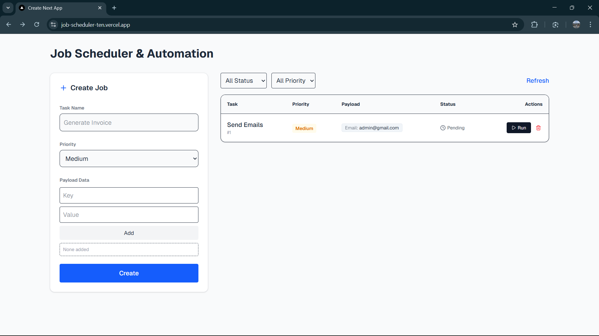
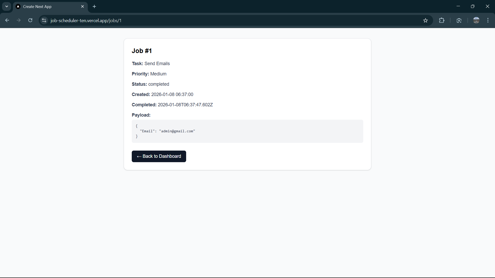
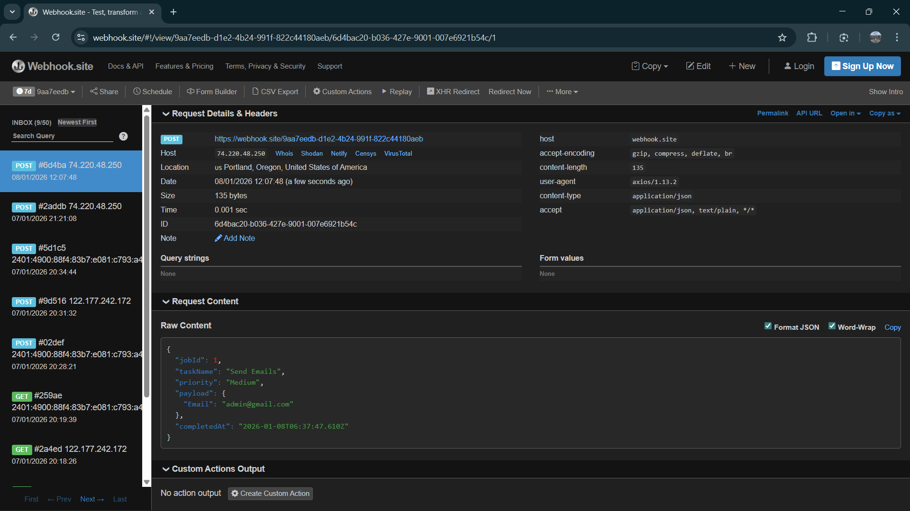

# 📦 Job Scheduler & Automation Dashboard

A full-stack mini automation engine that allows users to create jobs, run tasks asynchronously, track execution status, and trigger webhooks when a job completes.

Built for Dotix Full Stack Developer Assignment.

## 🚀 Live Links
Component	URL
- Frontend (Next.js)	https://job-scheduler-ten.vercel.app/

- Backend (Node/Express)	https://job-scheduler-6xvu.onrender.com

- Webhook Test URL	https://webhook.site/9aa7eedb-d1e2-4b24-991f-822c44180aeb

## 🧠 Features
### 🔧 Backend (Node.js + Express + SQLite)

- ✔ Create jobs
- ✔ List jobs (with filters)
- ✔ Get job details
- ✔ Run job (simulate background task)
- ✔ Update status → pending → running → completed
- ✔ Trigger webhook on completion
- ✔ Delete job
- ✔ Uses SQLite (or MySQL easy migration)

### 🎨 Frontend (Next.js + Tailwind)

- ✔ Create new job with dynamic payload
- ✔ Dashboard with live refreshing
- ✔ Status, priority & payload display
- ✔ Filters (pending / running / completed + priority)
- ✔ Run job action
- ✔ Delete job
- ✔ Job details page
- ✔ Modern, clean UI

## 🏗️ Architecture
```
root/
 ├── frontend/         # Next.js 14 UI
 │    ├── app/
 │    │   ├── page.tsx         # Dashboard UI
 │    │   └── jobs/[id].tsx    # Job detail view
 │    └── utils/api.ts         # API helpers
 │
 └── backend/
      ├── server.js            # Main express app
      ├── controllers/jobController.js
      ├── utils/webhook.js
      ├── config/db.js         # SQLite DB
```

## 🛢️ Database Schema
| Column      | Type     | Notes                         |
| ----------- | -------- | ----------------------------- |
| id          | Integer  | Primary Key                   |
| taskName    | String   | Job name                      |
| payload     | JSON     | Flexible data                 |
| priority    | String   | Low / Medium / High           |
| status      | String   | pending / running / completed |
| createdAt   | DateTime | Auto-set                      |
| completedAt | DateTime | Set when finished             |

## 🚦 REST API Endpoints
| Method     | Endpoint        | Description                  |
| ---------- | --------------- | ---------------------------- |
| POST       | `/jobs`         | Create a job                 |
| GET        | `/jobs`         | List jobs (supports filters) |
| GET        | `/jobs/:id`     | Get job details              |
| POST       | `/run-job/:id`  | Run a job (simulates async)  |
| DELETE     | `/jobs/:id`     | Delete job                   |
| (internal) | webhook trigger | POSTs to webhook.site        |

### Example webhook payload:
```
{
  "jobId": 12,
  "taskName": "Send Email",
  "priority": "High",
  "payload": {
    "email": "test@abc.com"
  },
  "completedAt": "2025-01-15T16:12:05.301Z"
}
```

## 🧪 Webhook Testing

1. Open https://webhook.site

2. Copy your unique URL

3. Add to .env in backend

4. Run job → observe payload received automatically

## 🔧 Local Setup
- **Clone the repo**
```
git clone https://github.com/YOUR-USER/job-scheduler
cd job-scheduler
```

- **Backend Setup**
```
cd backend
npm install
npm start
```

- Runs at: http://localhost:3001

- **Frontend Setup**
```
cd frontend
npm install
npm run dev
```

- Runs at: http://localhost:3000

## 🌍 Deployment
**Backend — Render**

- Select /backend folder

- Build command: npm install

- Start command: node server.js

- Add env vars:
```
PORT=3001
WEBHOOK_URL=https://webhook.site/your-id
```

**Frontend — Vercel**

- Select /frontend

- Add env:
```
PORT=3001
NEXT_PUBLIC_API_URL=https://your-render-backend
```

## 📸 Screenshots

<table>
  <tr>
    <td align="center"><strong>Dashboard</strong></td>
    <td align="center"><strong>Job Detail</strong></td>
  </tr>
  <tr>
    <td>
      
    </td>
    <td>
      
    </td>
  </tr>
  <tr>
    <td align="center" colspan="2"><strong>Webhook Trigger Proof</strong></td>
  </tr>
  <tr>
    <td colspan="2" align="center">
      
    </td>
  </tr>
</table>

## 🏁 Status

🎉 All assignment requirements completed:
- ✔ Create job
- ✔ Run job
- ✔ Track status
- ✔ Webhook
- ✔ Filters
- ✔ Job detail
- ✔ Delete job
- ✔ Frontend + backend deployed

## ⭐ Future Enhancements

1. Auth & role-based access

2. Retry failed webhooks

3. Move DB to MySQL/PlanetScale

4. Queue-based worker (BullMQ)
